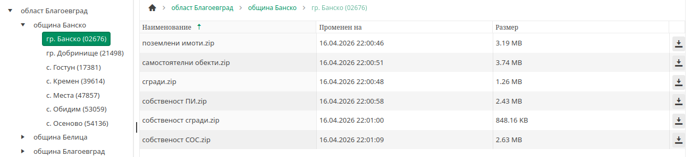
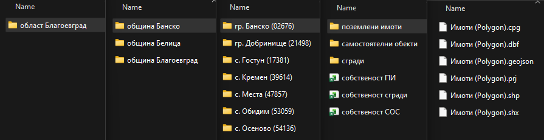

# Overview

A tool to download and convert data from `https://kais.cadastre.bg/bg/OpenData`

## Автоматично свали всички отворени данни от

## на локалния си компютър

# Usage

| Command                       | Description                                      |
|-------------------------------|--------------------------------------------------|
| `node kais.js list`           | Crawl folder structure and save to list.json     |
| `node kais.js download`       | Download and extract zip files from list.json    |
| `node kais.js shp2json`       | Convert .shp files in data/ to GeoJSON (EPSG:32635) |
| `node kais.js flatten_geojson`| Rename geojson files in current directory        |

